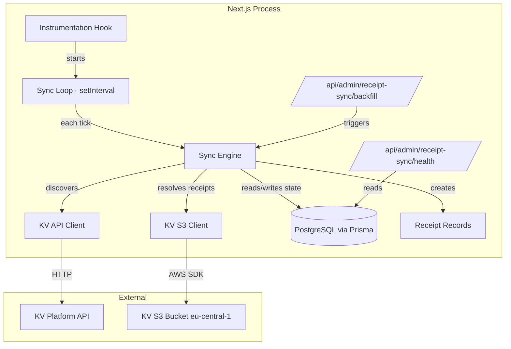
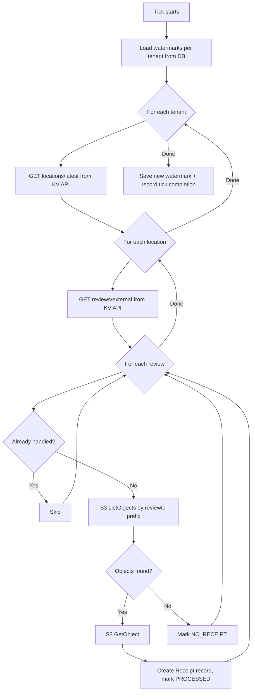

# Design Document: Receipt Sync Service

## Overview

The receipt sync service is a background polling process embedded within the existing Next.js application that incrementally discovers reviews from the KV platform API and resolves associated receipt files from the KV platform's AWS S3 bucket. It runs as a singleton `setInterval`-based loop within the Node.js process, persists sync state in PostgreSQL via Prisma, and creates Receipt records that appear in the existing admin receipts list.

The service is composed of:
- A **sync engine** (`lib/receipt-sync/`) containing the polling loop, KV API client, S3 client, state management, and configuration
- **API routes** for health monitoring (`/api/admin/receipt-sync/health`), backfill triggering (`/api/admin/receipt-sync/backfill`), and verification actions (existing PATCH endpoint extended)
- **Prisma models** for sync state tracking (`ReceiptSyncState`, `ReceiptSyncWatermark`)
- A **startup hook** that initializes the sync loop when the Next.js server starts

### Design Decisions

1. **Separate S3 client**: The KV platform's S3 bucket is in AWS eu-central-1, completely separate from the existing Cloudflare R2 storage. A dedicated `createKvS3Client()` factory in `lib/receipt-sync/kv-s3-client.ts` avoids polluting the existing R2 configuration.
2. **Prisma for state**: Using Prisma models (not raw SQL) for sync state keeps the codebase consistent and leverages existing migration tooling.
3. **Receipt model reuse**: Synced receipts create records in the existing `Receipt` model with a designated `userId` (a system user) so they appear in the admin receipts list without schema changes to the Receipt model itself.
4. **No automatic backfill**: The service starts with `now` as the initial watermark. Backfill is an explicit admin action to avoid surprise load on cold starts.
5. **Structured logging**: Uses a shared logger module (`lib/logger.ts`) rather than `console.*` per AGENTS.md rules.

## Architecture



### Tick Lifecycle



## Components and Interfaces

### Module Structure

```
lib/receipt-sync/
├── index.ts                 # Public API: startSyncLoop(), stopSyncLoop(), executeTick()
├── config.ts                # Configuration loading from env vars with defaults
├── kv-api-client.ts         # KV platform API client with rate limiting and retry
├── kv-s3-client.ts          # Dedicated S3 client for KV bucket (eu-central-1)
├── sync-engine.ts           # Core tick execution logic
├── state-repository.ts      # Prisma-based state read/write operations
├── receipt-creator.ts       # Creates Receipt records from synced data
└── types.ts                 # Shared types for the sync module

lib/logger.ts                # Shared structured logger (pino-based)
```

### Key Interfaces

```typescript
// lib/receipt-sync/types.ts

interface SyncConfiguration {
  readonly kvApiBaseUrl: string;
  readonly kvPublicationApiTokens: ReadonlyArray<TenantToken>;
  readonly kvReceiptS3BucketName: string;
  readonly kvReceiptAwsRegion: string;
  readonly pollIntervalSeconds: number;
  readonly watermarkSafetySeconds: number;
  readonly pageSize: number;
  readonly workerConcurrency: number;
  readonly apiRateLimitSeconds: number;
  readonly receiptAutoVerifyEnabled: boolean;
}

interface TenantToken {
  readonly tenantId: number;
  readonly token: string;
}

interface SyncTickResult {
  readonly tenantId: number;
  readonly locationsDiscovered: number;
  readonly reviewsDiscovered: number;
  readonly receiptsProcessed: number;
  readonly noReceiptCount: number;
  readonly failedCount: number;
  readonly newWatermark: Date;
  readonly durationMilliseconds: number;
}

type ReviewSyncStatus = "PROCESSED" | "NO_RECEIPT" | "FAILED";

interface ReviewSyncRecord {
  readonly reviewId: string;
  readonly tenantId: number;
  readonly locationId: string;
  readonly status: ReviewSyncStatus;
  readonly s3Key: string | null;
  readonly s3Etag: string | null;
  readonly attemptCount: number;
  readonly processedAt: Date;
  readonly errorMessage: string | null;
  readonly receiptContent: object | null;
}
```

### API Routes

| Route | Method | Auth | Purpose |
|-------|--------|------|---------|
| `/api/admin/receipt-sync/health` | GET | Admin | Sync service health status |
| `/api/admin/receipt-sync/backfill` | POST | Admin | Trigger manual backfill |
| `/api/admin/receipts` (existing) | PATCH | Admin | Verify/reject receipts (already exists) |

### KV API Client Interface

```typescript
// lib/receipt-sync/kv-api-client.ts

interface KvApiClient {
  fetchLocationsLatest(
    token: string,
    dateSince: Date,
    pageSize: number
  ): AsyncGenerator<LocationDto[]>;

  fetchReviewsForLocation(
    token: string,
    locationId: string,
    dateSince: Date,
    pageSize: number
  ): AsyncGenerator<ReviewDto[]>;
}
```

The client uses `AsyncGenerator` for pagination, yielding pages until a short page is encountered. Rate limiting is enforced internally via a token bucket that ensures at most one request per `apiRateLimitSeconds`.

### KV S3 Client Interface

```typescript
// lib/receipt-sync/kv-s3-client.ts

interface KvS3Operations {
  listReceiptObjects(reviewId: string): Promise<S3ObjectInfo[]>;
  getReceiptContent(s3Key: string): Promise<Buffer>;
}
```

This client is configured with:
- Region: `KV_RECEIPT_AWS_REGION` (default `eu-central-1`)
- Bucket: `KV_RECEIPT_S3_BUCKET_NAME`
- Credentials: `KV_RECEIPT_AWS_ACCESS_KEY_ID` / `KV_RECEIPT_AWS_SECRET_ACCESS_KEY`

Completely independent from the existing Cloudflare R2 client in `lib/aws-config.ts`.

## Data Models

### New Prisma Models

```prisma
model ReceiptSyncState {
  id            String   @id @default(cuid())
  reviewId      String   @unique
  tenantId      Int
  locationId    String
  status        String   // "PROCESSED" | "NO_RECEIPT" | "FAILED"
  s3Key         String?
  s3Etag        String?
  attemptCount  Int      @default(0)
  processedAt   DateTime @default(now())
  errorMessage  String?
  receiptContent String? @db.Text // JSON blob with extracted metadata
  receiptId     String?  // FK to Receipt model when a Receipt record is created
  createdAt     DateTime @default(now())
  updatedAt     DateTime @updatedAt

  @@index([tenantId])
  @@index([status])
  @@index([reviewId, status])
}

model ReceiptSyncWatermark {
  id        String   @id @default(cuid())
  tenantId  Int      @unique
  watermark DateTime
  updatedAt DateTime @updatedAt
}

model ReceiptSyncTick {
  id                    String   @id @default(cuid())
  tenantId              Int
  startedAt             DateTime
  completedAt           DateTime?
  locationsDiscovered   Int      @default(0)
  reviewsDiscovered     Int      @default(0)
  receiptsProcessed     Int      @default(0)
  noReceiptCount        Int      @default(0)
  failedCount           Int      @default(0)
  errorMessage          String?
  createdAt             DateTime @default(now())

  @@index([tenantId, completedAt])
}
```

### Receipt Model Integration

Synced receipts create records in the existing `Receipt` model:
- `userId`: A dedicated system user (created via seed) representing the sync service
- `cloudStoragePath`: The S3 key from the KV bucket (prefixed with `kv-sync:` to distinguish from R2 paths)
- `originalFilename`: Derived from the S3 key
- `fileType`: Inferred from the file extension (image or pdf)
- `extractedShopName`, `extractedDate`, `extractedAmount`: Populated from the review metadata available in the KV API response
- `verificationStatus`: Set to "verified" if auto-verify is enabled, otherwise "pending"
- `ocrConfidence`: Set to null (OCR not performed on synced receipts — data comes from KV platform)

### Configuration Defaults

| Variable | Default | Description |
|----------|---------|-------------|
| `KV_API_BASE_URL` | (required) | KV platform API base URL |
| `KV_PUBLICATION_API_TOKENS` | (required) | Comma-separated `tenantId:token` pairs |
| `KV_RECEIPT_S3_BUCKET_NAME` | (required for S3) | S3 bucket name |
| `KV_RECEIPT_AWS_REGION` | `eu-central-1` | AWS region for KV S3 bucket |
| `KV_RECEIPT_AWS_ACCESS_KEY_ID` | (from env/IAM) | AWS credentials for KV bucket |
| `KV_RECEIPT_AWS_SECRET_ACCESS_KEY` | (from env/IAM) | AWS credentials for KV bucket |
| `POLL_INTERVAL_SECONDS` | `300` | Seconds between sync ticks |
| `WATERMARK_SAFETY_SECONDS` | `60` | Seconds subtracted from watermark for clock skew |
| `PAGE_SIZE` | `200` | Items per page for KV API pagination |
| `WORKER_CONCURRENCY` | `4` | Max parallel location workers |
| `API_RATE_LIMIT` | `1` | Min seconds between KV API requests |
| `RECEIPT_AUTO_VERIFY_ENABLED` | `false` | Auto-verify synced receipts |
| `MAX_RETRY_ATTEMPTS` | `5` | Max retries before dead letter |

## Correctness Properties

*A property is a characteristic or behavior that should hold true across all valid executions of a system — essentially, a formal statement about what the system should do. Properties serve as the bridge between human-readable specifications and machine-verifiable correctness guarantees.*

### Property 1: Watermark safety subtraction

*For any* watermark timestamp and any positive watermarkSafetySeconds value, the computed query date SHALL equal the watermark minus the safety seconds, ensuring the query window always overlaps with the previous tick.

**Validates: Requirements 1.1**

### Property 2: Pagination collects all items and terminates on short page

*For any* sequence of API response pages where each page has a configurable size, the pagination logic SHALL collect all items from all pages and terminate exactly when a page with fewer items than pageSize is returned.

**Validates: Requirements 1.2**

### Property 3: Watermark advances to maximum observed date

*For any* non-empty collection of review creation dates processed in a tick, the new watermark SHALL equal the maximum date in that collection. If no reviews are processed, the watermark SHALL remain unchanged.

**Validates: Requirements 1.3**

### Property 4: Idempotent skip for handled reviews

*For any* review that has status PROCESSED or NO_RECEIPT in the state store, processing that review again SHALL make zero external calls (S3 or API) and SHALL not modify the existing state record.

**Validates: Requirements 2.5, 3.3**

### Property 5: Dead letter after max retry attempts

*For any* review with status FAILED, if its attemptCount is less than maxRetryAttempts it SHALL be eligible for retry, and if its attemptCount is greater than or equal to maxRetryAttempts it SHALL be treated as a dead letter and skipped permanently.

**Validates: Requirements 3.4**

### Property 6: Health status determination

*For any* lastTickCompletedAt timestamp and currentTime, the health endpoint SHALL return HTTP 200 if and only if (currentTime - lastTickCompletedAt) is less than or equal to (2 * pollIntervalSeconds). Otherwise it SHALL return HTTP 503.

**Validates: Requirements 5.1, 5.2**

### Property 7: Auto-verify flag determines initial receipt status

*For any* newly synced receipt, if RECEIPT_AUTO_VERIFY_ENABLED is true the verificationStatus SHALL be "verified", and if false or unset the verificationStatus SHALL be "pending".

**Validates: Requirements 9.1, 9.2**

### Property 8: Jitter is bounded within poll interval percentage

*For any* pollIntervalSeconds value, the computed jitter SHALL be greater than or equal to 0 and less than or equal to 0.1 times pollIntervalSeconds.

**Validates: Requirements 4.6**

## Error Handling

### Transient Failures (Retryable)

| Error Source | Condition | Action |
|-------------|-----------|--------|
| KV API | 5xx, network timeout | Exponential backoff, up to 3 retries per request |
| KV API | 429 with Retry-After | Wait specified duration, then retry |
| S3 | 5xx, throttling, timeout | Mark review as FAILED, increment attempt counter, retry next tick |

### Terminal Failures (Non-Retryable)

| Error Source | Condition | Action |
|-------------|-----------|--------|
| KV API | 4xx (except 429) | Log error, skip request, do not retry |
| S3 | Empty listing | Mark as NO_RECEIPT (not an error) |
| S3 | 403 (access denied) | Log error, mark FAILED, alert via health degradation |
| State store | Database error | Log error, abort tick, health endpoint reports unhealthy |

### Dead Letter Handling

Reviews that exceed `MAX_RETRY_ATTEMPTS` are left in FAILED status with their error message preserved. They are excluded from future processing. An operator can manually reset them via direct database access or a future admin endpoint.

### Graceful Degradation

- If `KV_API_BASE_URL` or tokens are missing: sync loop starts but skips ticks, health endpoint reports configuration issue
- If `KV_RECEIPT_S3_BUCKET_NAME` is missing: reviews are discovered but receipt fetching is skipped (reviews still tracked as NO_RECEIPT)
- If database is unreachable: tick fails, health endpoint returns 503

## Testing Strategy

### Property-Based Tests

Property-based testing is appropriate for this feature because the sync engine contains pure logic functions (watermark arithmetic, pagination termination, state transition decisions, health status computation) that have universal properties holding across a wide input space.

**Library**: `fast-check` (JavaScript/TypeScript PBT library)
**Configuration**: Minimum 100 iterations per property test
**Tag format**: `Feature: receipt-sync-service, Property {number}: {property_text}`

Properties to implement:
1. Watermark subtraction arithmetic
2. Pagination termination logic
3. Maximum date computation
4. Idempotent state skip logic
5. Retry cap / dead letter logic
6. Health status determination
7. Auto-verify flag logic
8. Jitter bounds

### Unit Tests (Example-Based)

- KV API client: correct URL construction, header passing, error classification
- S3 prefix construction from reviewId
- Configuration loading with defaults and validation
- Receipt creator: correct field mapping from sync data to Receipt model
- Backfill guard: rejects when watermark is recent without force flag

### Integration Tests

- Full tick execution with mocked KV API and S3 responses
- Backfill endpoint: auth check, watermark reset, tick trigger
- Health endpoint: correct status codes based on tick recency
- State repository: correct Prisma queries for state transitions

### Test File Structure

```
tests/receipt-sync/
├── config.test.ts
├── sync-engine.test.ts
├── kv-api-client.test.ts
├── state-repository.test.ts
├── health-endpoint.test.ts
├── backfill-endpoint.test.ts
└── properties.test.ts          # All PBT properties
```
