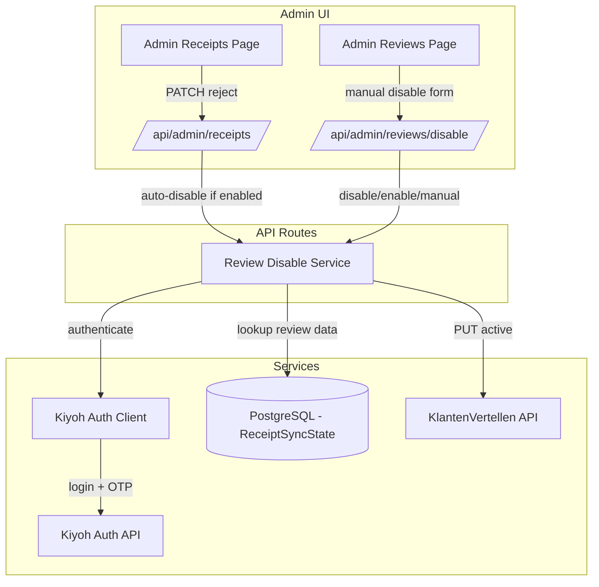

# Design Document: Review Disable on Failed Verification

## Overview

This feature adds the ability to disable (and re-enable) reviews on KlantenVertellen when receipt verification fails. It introduces a Kiyoh admin authentication client (username + password + TOTP), a review disable/enable service, and integrates into the existing admin receipts PATCH flow for automatic disabling. A manual disable form on the admin reviews page allows disabling arbitrary reviews by ID.

### Design Decisions

1. **Separate auth client**: `lib/review-disable/kiyoh-auth-client.ts` handles the two-step login + OTP flow. Tokens are not cached (admin operations are infrequent) to avoid token expiry complexity.
2. **Single service module**: `lib/review-disable/review-disable-service.ts` handles both disable and enable operations, looking up ReceiptSyncState when a receiptId is provided, or accepting raw reviewId/locationId/tenantId for manual operations.
3. **Non-blocking auto-disable**: When `RECEIPT_AUTO_DISABLE_ENABLED=true`, the PATCH handler fires the disable asynchronously and does not block the response. Failures are logged but do not affect the receipt status update.
4. **TOTP generation**: Uses the `otpauth` npm package to generate TOTP codes from the `KIYOH_ADMIN_TOTP` secret.
5. **Existing admin reviews page**: The manual disable form is added to `app/admin/reviews/page.tsx` as a collapsible section at the top of the page.

## Architecture



## Components and Interfaces

### Module Structure

```
lib/review-disable/
├── kiyoh-auth-client.ts     # Two-step auth: login → OTP verify → bearer token
├── review-disable-service.ts # Disable/enable review operations
└── types.ts                  # Shared types for this module

app/api/admin/reviews/disable/
└── route.ts                  # POST endpoint for disable/enable/manual operations
```

### Kiyoh Auth Client

```typescript
// lib/review-disable/kiyoh-auth-client.ts

interface KiyohAuthResult {
  readonly bearerToken: string;
}

/**
 * Authenticates with Kiyoh admin API using credentials + TOTP.
 * 1. POST /v1/authentication/login → gets otpSessionId
 * 2. Generate TOTP code from KIYOH_ADMIN_TOTP secret
 * 3. POST /v1/authentication/verify-otp → gets hash (bearer token)
 */
async function authenticateKiyohAdmin(): Promise<KiyohAuthResult>;
```

### Review Disable Service

```typescript
// lib/review-disable/review-disable-service.ts

interface DisableByReceiptResult {
  readonly success: boolean;
  readonly reviewId: string;
  readonly error?: string;
}

interface DisableByReviewIdResult {
  readonly success: boolean;
  readonly error?: string;
}

/** Disable review linked to a receipt via ReceiptSyncState lookup */
async function disableReviewByReceiptId(receiptId: string): Promise<DisableByReceiptResult>;

/** Enable review linked to a receipt via ReceiptSyncState lookup */
async function enableReviewByReceiptId(receiptId: string): Promise<DisableByReceiptResult>;

/** Disable review by direct reviewId/locationId/tenantId (no receipt link needed) */
async function disableReviewManual(
  reviewId: string,
  locationId: string,
  tenantId: number
): Promise<DisableByReviewIdResult>;
```

### API Route

```typescript
// app/api/admin/reviews/disable/route.ts

// POST body variants:
// 1. Disable by receipt: { action: "disable", receiptId: "..." }
// 2. Enable by receipt:  { action: "enable", receiptId: "..." }
// 3. Manual disable:     { action: "disable-manual", reviewId: "...", locationId: "...", tenantId: 98 }
```

### Integration with Existing PATCH Route

The existing `app/api/admin/receipts/route.ts` PATCH handler is extended:
- After updating verificationStatus to "rejected", check `RECEIPT_AUTO_DISABLE_ENABLED`
- If enabled, call `disableReviewByReceiptId` in a fire-and-forget pattern (no await blocking the response)
- Log success or failure

## API Endpoints

| Route | Method | Auth | Purpose |
|-------|--------|------|---------|
| `/api/admin/reviews/disable` | POST | Admin | Disable/enable review (by receipt or manual) |
| `/api/admin/receipts` (existing) | PATCH | Admin | Extended: auto-disable on rejection |

### POST `/api/admin/reviews/disable` Request/Response

**Request (disable by receipt):**
```json
{ "action": "disable", "receiptId": "cuid123" }
```

**Request (enable by receipt):**
```json
{ "action": "enable", "receiptId": "cuid123" }
```

**Request (manual disable):**
```json
{ "action": "disable-manual", "reviewId": "uuid-here", "locationId": "1080211", "tenantId": 98 }
```

**Success Response (200):**
```json
{ "success": true, "reviewId": "uuid-here" }
```

**Error Response (400/404/500):**
```json
{ "success": false, "error": "No ReceiptSyncState found for receipt" }
```

## External API Interactions

### Kiyoh Login

```
POST https://www.kiyoh.com/v1/authentication/login
Content-Type: application/x-www-form-urlencoded

tenantId=98&username={KIYOH_ADMIN_USERNAME}&password={KIYOH_ADMIN_PASSWORD}

Response: { "requiresOtp": true, "otpSessionId": "abc-123-session" }
```

### Kiyoh OTP Verify

```
POST https://www.kiyoh.com/v1/authentication/verify-otp
Content-Type: application/x-www-form-urlencoded

otpSessionId={otpSessionId}&otpCode={generated-totp-code}

Response: { "hash": "authenticated-hash-value" }
```

### KlantenVertellen Disable/Enable Review

```
PUT https://www.klantenvertellen.nl/v1/review/active
Authorization: Bearer {hash}
Content-Type: application/json

{ "locationId": "1080211", "tenantId": 98, "reviewId": "uuid", "active": false }
```

## UI Changes

### Admin Reviews Page — Manual Disable Form

A collapsible "Handmatig review uitschakelen" section at the top of the admin reviews page with:
- Text input for Review ID (UUID)
- Text input for Location ID
- Number input for Tenant ID (default: 98)
- "Disable Review" button
- Success/error feedback toast

### Admin Receipts — Disable/Enable Buttons

The existing admin receipt card gains:
- A "Disable Review" button (visible when receipt has a linked ReceiptSyncState and verificationStatus is "rejected")
- A "Re-enable Review" button (visible when review was previously disabled)
- These buttons call the `/api/admin/reviews/disable` endpoint

## Error Handling

| Error Source | Condition | Action |
|-------------|-----------|--------|
| Kiyoh login | Network error or non-200 | Log error, throw with descriptive message |
| Kiyoh OTP | Invalid TOTP or expired session | Log error, throw with descriptive message |
| KV disable API | Non-success HTTP status | Log error with status and body, return failure result |
| ReceiptSyncState lookup | No record found | Return error indicating no linked review data |
| Auto-disable | Any failure | Log error, do not block receipt status update response |

## Correctness Properties

### Property 1: Disable operation sends correct payload

*For any* valid reviewId, locationId, and tenantId combination, the disable operation SHALL send a PUT request with `active: false` and the exact provided values in the JSON body.

**Validates: Requirements 2.2**

### Property 2: Enable operation sends active true

*For any* valid receiptId with a linked ReceiptSyncState, the enable operation SHALL send a PUT request with `active: true` using the reviewId, locationId, and tenantId from the ReceiptSyncState record.

**Validates: Requirements 6.1**

### Property 3: Auto-disable is non-blocking

*For any* receipt rejection where RECEIPT_AUTO_DISABLE_ENABLED is true, the PATCH response SHALL return successfully regardless of whether the disable operation succeeds or fails.

**Validates: Requirements 4.3**
